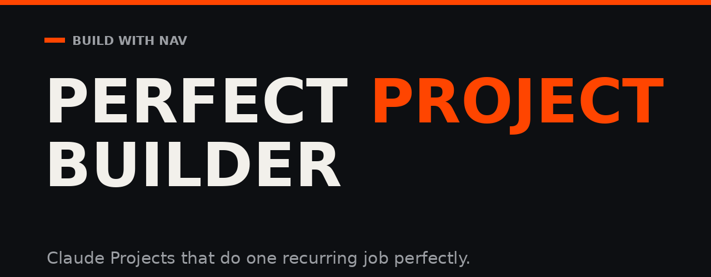

# Perfect Project Builder


Most people build one vague "AI assistant for my business" project, get generic output, and assume Claude is overrated. The problem is never Claude. It is that the project has no real material in it and no clear job.

This plugin fixes that by doing the work with you. It interviews you, tells you exactly which files to go find, writes your Project Instructions and knowledge documents as real files in a numbered folder, then walks you through creating the project and tests it with you before it lets you go.

Built for people who have never done this before.

## What actually happens

1. **It checks this is worth building.** A one-off task gets you a good reusable prompt instead. A project that does everything gets broken into the one job worth starting with.
2. **Four short rounds of questions.** What you repeat. What real material you have. How you sound and what you would never say. What facts have to be right and who signs off. Three to five questions at a time, with a checkpoint after each round.
3. **It sends you to go find real work.** With a specific list and specific places to look, because "upload some examples" gets nobody anywhere. If you come back with nothing, it talks the examples out of you instead and writes them up.
4. **It builds the files.** A numbered folder where the names tell you the order of operations.
5. **It sets it up with you.** Step by step, waiting at each one, including the two things every beginner gets wrong.
6. **It tests it and reads the result.** You paste the first output back and it tells you whether the problem is the instructions, the examples, or the facts. A beginner cannot tell those apart alone.

## What you end up with

```
[Your Project Name] Claude Project/
  START-HERE.md                        your setup guide
  Setup_Checklist.md                   tick these off as you go
  1-PASTE-THIS/
    project-instructions.md            goes in the Instructions box
  2-UPLOAD-THESE/
    00_Project_Brief.md                these get uploaded
    01_Voice_and_Non_Negotiables.md
    02_Gold_Standard_Examples.md
    03_Source_of_Truth.md
    04_Workflow_and_QA.md
  3-TRY-THESE/
    starter-prompts.md
```

Folder 1 gets pasted. Folder 2 gets uploaded. Folder 3 is what you type first. Confusing pasting and uploading is the single most common beginner mistake, so the folder names do that teaching for you.

## The core principle

> Instructions tell Claude **how to behave**. Knowledge documents give Claude the **proof, examples, facts, and source material** to do the job. Never bury both jobs in one giant document.

"Be conversational" is theory. Five of your real captions is evidence. This builds with evidence, and it never invents an example to fill a gap, because a fake example teaches Claude a voice you do not have and you will never work out why the output feels off.

## Install

- **Fastest:** download [`perfect-project-builder.plugin`](perfect-project-builder.plugin), open it in Cowork, click install. Want just the skill? Download [`build-perfect-project.skill`](build-perfect-project.skill).
- **From the marketplace:** in Claude Code or Cowork, run:

  ```
  /plugin marketplace add navinramharak-rgb/perfect-project-builder
  /plugin install perfect-project-builder@build-with-nav
  ```

After installing, manage it in Settings under Capabilities.

## How to start it

Run the command:

```
/build-project
```

Or just say what you keep redoing and the skill picks it up on its own:

> "Build me a Claude Project that turns my rough voice notes into a weekly newsletter."

> "I keep pasting the same brand context into every chat. Turn this into a proper project."

> "I have no idea how to set up Claude for my business."

It also triggers on "set up a Claude Project," "Project Instructions," "knowledge base," or any description of a workflow you repeat weekly.

## What is inside

```
perfect-project-builder/
  .claude-plugin/
    plugin.json                       plugin manifest
    marketplace.json                  makes the repo one-click installable
  commands/
    build-project.md                  /build-project
  skills/build-perfect-project/
    SKILL.md                          the guided build, Phase 0 to Phase 7
    references/
      interview-guide.md              the four question rounds, word for word
      setup-walkthrough.md            click-by-click setup and troubleshooting
      instructions-playbook.md        the instructions-vs-knowledge split
      context-blueprints.md           the five knowledge documents, specified
      patterns-and-example.md         use-case patterns and a worked example
    assets/starter-kit/
      00_Project_Brief.md             fill-in knowledge templates
      01_Voice_and_Non_Negotiables.md
      02_Gold_Standard_Examples.md
      03_Source_of_Truth.md
      04_Workflow_and_QA.md
      START-HERE-template.md          the personalized setup guide
      Setup_Checklist.md              tick-box version of setup
      HOW-TO-USE-THIS-KIT.md
  perfect-project-builder.plugin      one-click install for Cowork
  build-perfect-project.skill         one-click install for the skill alone
  LICENSE                             MIT
  CHANGELOG.md                        version history
```

## Philosophy

- **Interview, do not assume.** Nobody gets a good project out of a one-line request.
- **One project, one job.** "Write my content" is too broad. "Turn rough voice notes into three Reel packages for business owners" is a usable project.
- **Evidence over theory.** Real examples, real facts, real past work. Never invented ones.
- **Exclusions prevent drift.** Every project gets a What Not To Do section or it slides into generic AI output.
- **Facts live in one place.** A dated Source of Truth, so updating an offer never means rewriting instructions.
- **The job is not done when the files exist.** It is done when you have tested it and someone has read the result.

## License

MIT. Free to use, modify, and share, including commercially. Keep the copyright notice. See `LICENSE`.

## Credit

Made by Build With Nav. Learn more at [buildwithnav.com](https://buildwithnav.com).
